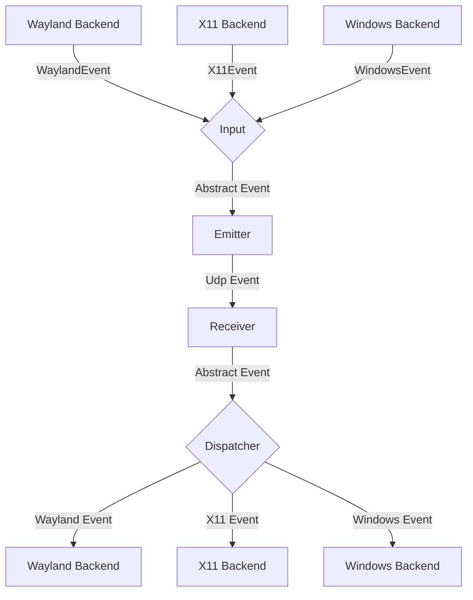
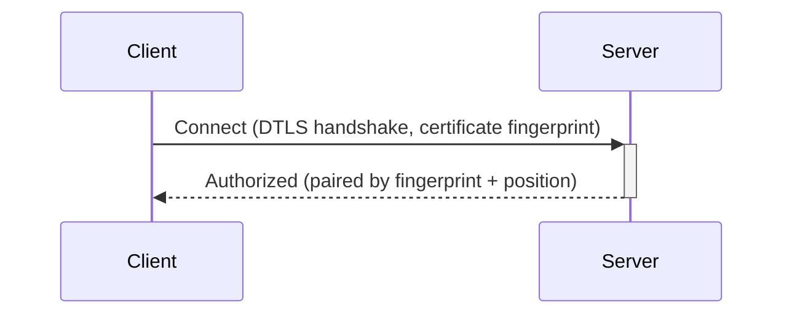

# General Software Architecture

## Operation modes

Each instance has one explicit operation mode, persisted in `config.toml` and
switchable from the GTK sidebar:

- **Server** starts input capture, listens for incoming DTLS connections
  (UDP, default port 4242) and controls paired clients.
- **Client** starts input emulation and dials out to a configured server
  (`server_hostname`/`server_ips`/`server_port`), accepting control from it
  once authorized. Only the server needs an open firewall port; the client
  works behind NAT without one.

Backends are started lazily from this mode so the OS is asked only for relevant
permissions. A fresh installation starts unconfigured and requests nothing
until the first explicit selection. In client mode, capture can be enabled later, after a remote
pointer enters, solely to detect the edge handoff back to the server.

## Events

Each instance of deskunion can emit and receive events, where
an event is either a mouse or keyboard event for now.

The general Architecture is shown in the following flow chart:

### Input
The input component is responsible for translating inputs from a given backend
to a standardized format and passing them to the event emitter.

### Emitter
The event emitter serializes events and sends them over the network
to the correct client.

### Receiver
The receiver receives events over the network and deserializes them into
the standardized event format.

### Dispatcher
The dispatcher component takes events from the event receiver and passes them
to the correct backend corresponding to the type of client.

## Connections and pairing

All traffic — input events, control datagrams and audio — runs over DTLS on a
single UDP port (default 4242). The server (capture side) is the only one
listening; the client (emulation side) dials out to its configured server
endpoint. During the DTLS handshake both sides learn each other's certificate
fingerprint, which is the stable identity of a device (source IPs are useless
behind NAT and only used to route datagrams).

An unknown fingerprint must be authorized on the server first. The authorized
device then connects and waits "parked" until the user assigns it a screen
position (left, right, top, bottom); that assignment pairs the device by
persisting its `fingerprint` in the corresponding `[[clients]]` entry of
`config.toml`. Only paired devices can be entered.

Liveness: the listener (server) sends `Ping` roughly every 5 s and the dialer
(client) answers `Pong(emulation_active)` — only the emulation side knows
whether it can currently receive input. Any received datagram counts as a
sign of life; after ~6 unanswered pings the peer is declared dead and its
connection is closed deterministically.

Audio is one-directional (client → server) over the same DTLS connection: the
client captures its system output (WASAPI loopback on Windows, PipeWire
monitor on Linux, CoreAudio loopback on macOS ≥ 14.6), encodes it as Opus and
the server plays it back. `AudioControl::Start` is retransmitted until traffic
flows, receivers are created lazily on the first frame, and `Stop` is sent on
teardown.

## Problems
The network protocol supports bidirectional events, but the selected operation
mode assigns one direction to each instance at runtime. This avoids requesting
both capture and emulation permissions merely because the protocol is capable
of both directions.

It needs to be ensured, that whenever a device is controlled the controlled
device does not transmit the events back to the original sender.
Otherwise events are multiplied and either one of the instances crashes.

To keep the implementation of input backends simple this needs to be handled
on the server level.

## Device State - Active and Inactive
To solve this problem, each device can be in exactly two states:

Either events are sent or received.

This ensures that
- a) Events can never result in a feedback loop.
- b) As soon as a virtual input enters another client, deskunion will stop receiving events,
which ensures clients can only be controlled directly and not indirectly through other clients.
