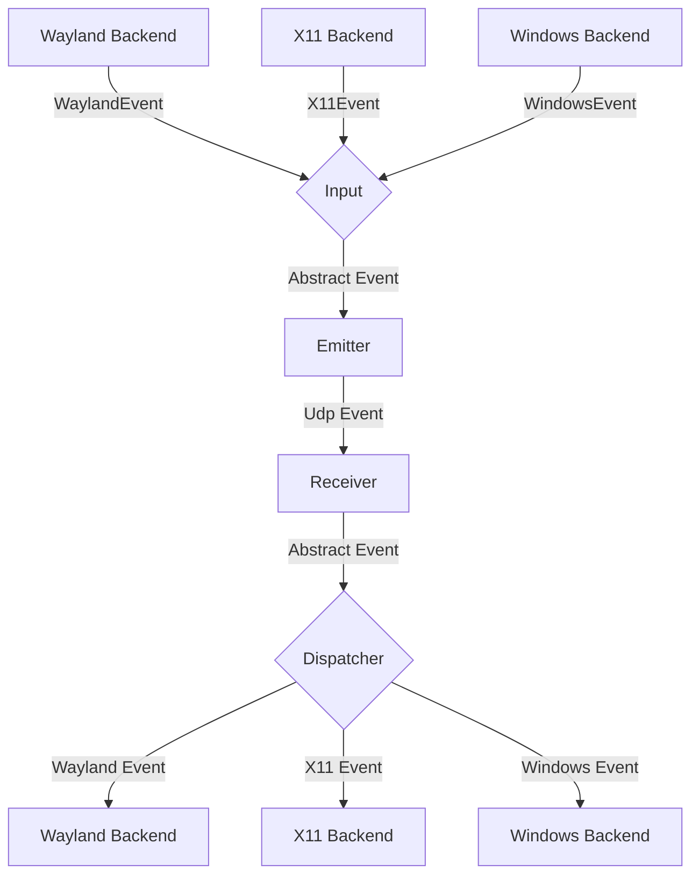
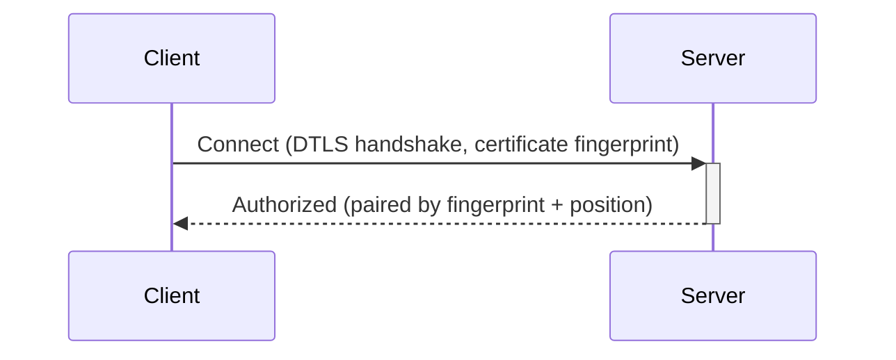

# General Software Architecture

## Release 0.2.5

Redesigns the screen arrangement as a compact numbered layout sharing one card with the client list, adds a persistent error banner, remembers the selected audio devices and tidies interface wording.

## Release 0.2.4

Closes the listener when the server is stopped so audio and connections end, fixes clipboard writes on Windows, and refreshes the interface: accessible names, confirmed deletion, a persistent error banner, remembered audio devices and clearer client rows.

## Release 0.2.3

Keeps remote mouse and keyboard input responsive while audio streams, shows the
real connection state in the screen arrangement, and moves clipboard sharing to
Settings.

## Release 0.2.2

Improves input-capture permission handling, audio test reliability, and cross-platform build support.

## Release 0.2.1

Clipboard sharing is on by default, clients announce their computer name, and the arrangement canvas is reworked.

## Release 0.2.0

Adds opt-in text clipboard sharing between Windows and GNOME Wayland, Windows
process-loopback audio capture that is independent of master output volume on
supported builds, and clearer audio/clipboard controls in the GTK frontend.

Clipboard sharing is enabled by default. Opt out on a device from
**Settings → Clipboard** ("Share clipboard text") and restart DeskUnion so the platform backends start with
the setting disabled.

## Release workflow

Pushing a `v<version>` tag runs `release.yml`, which calls one reusable
workflow per platform and publishes every artifact (the tag must match the
`deskunion-app` version):

- Windows x86_64: Inno Setup installer (`*-setup.exe`) and portable ZIP.
- macOS: DMG for `aarch64` (Intel is disabled: Homebrew has no x86_64 bottles for GTK4).
- Linux: Flatpak bundle and AppImage, each for `x86_64` and `aarch64`.
- `SHA256SUMS.txt` covering all of the above.

## Operation modes

Each instance has one explicit operation mode, persisted in `config.toml` and
switchable from the GTK sidebar:

- **Server** starts input capture, listens for incoming DTLS connections
  (UDP, default port 4242) and controls paired clients.
- **Client** starts input emulation and dials out to a configured server
  (`server_hostname`/`server_ips`/`server_port`), accepting control from it
  once authorized. Only the server needs an open firewall port; the client
  works behind NAT without one.

Backends are started lazily from this mode so the OS is asked only for relevant
permissions. A fresh installation starts unconfigured and requests nothing
until the first explicit selection. In client mode, capture can be enabled later, after a remote
pointer enters, solely to detect the edge handoff back to the server.

## Computer-name metadata

The client reads its local OS hostname using `hostname` 0.4.2. On Windows only,
`COMPUTERNAME` is a fallback if the OS query fails or returns an empty name.
Invalid UTF-8, empty names, names longer than 255 UTF-8 bytes, and Unicode control
characters are rejected rather than truncated or converted lossily.

`ComputerName` is variable datagram event **17**: one event-id byte followed by
1–255 UTF-8 bytes; the DTLS datagram boundary supplies the payload length. Both
encoding and decoding validate the name. The fixed-size `ProtoEvent::Hello`
commit-only wire format is unchanged. Older peers skip unknown event ids.

The established client session sends the name immediately and retransmits it
on the existing two-second metadata/audio-control interval, independently of
audio features and runtime settings. The authorized DTLS listener forwards it
to `CaptureTask`. `ClientManager::set_announced_name` fills only an empty label
on a fingerprint-paired client bound to that connection's `active_addr`; it
does not call `set_hostname`, clear routing/DNS state, or overwrite a nonempty
user label. `ICaptureEvent::ClientNameChanged` tells the service to save config
and broadcast the updated client state. Existing unnamed pairs are filled on
reconnect. Parked devices are ignored until position assignment binds their
connection, then the next retransmission fills their label.

Focused regression checks cover protocol round trips/malformed names, preserved
connection state and explicit labels, and real DTLS name retransmission after
pairing with audio disabled:

```sh
cargo test -p deskunion-proto --locked
cargo test -p deskunion-app --no-default-features --locked
cargo test -p deskunion-app --no-default-features --features audio --locked
```

## GTK interface and verification

The frontend retains its Rust/Relm4 architecture and four pages: Connections
(titled "Connection" in client mode and "Welcome" while unconfigured), Audio, Logs,
and Settings. A fresh installation presents an `AdwStatusPage`
with explicit Server/Client actions. An `AdwBreakpoint` at 860sp changes the
existing `AdwOverlaySplitView` to an overlay; it does not replace the page model.
The supported minimum window size is 480×360, with scrolling for shorter views.
The sidebar has its own scroller below a fixed native header, so its controls
remain reachable when the window height is reduced.
Navigation uses explicit row activation (click or Enter). Restoring sidebar
focus during reflow does not activate a different page.

Server connection checks disable repeated submissions and show persistent
inline failures without clearing the entered address. Listening-port edits
accept 1–65535, use 4242 for blank input, and display invalid values instead of
silently substituting the default. A shared signal guard suppresses programmatic
entry resets before a Relm4 message is queued, preserving apply/cancel state.

GNOME design references: `libadwaita/doc/adaptive-layouts.md`,
`libadwaita/doc/style-classes.md`, and the workspace `gnome-ui-ux` skill's
patterns reference (2026-10-03). Decisions use components available within the
declared GTK 4.14 / libadwaita 1.5 API floors (the `v4_14`/`v1_5` binding features);
dependencies were not upgraded. The Flatpak manifest in `build-aux` targets the
GNOME 50 runtime (libadwaita 1.9). Behaviour at the declared floors has not been
tested.

Checks from the repository root:

```sh
cargo fmt --all --check
cargo test -p deskunion-gtk --locked
cargo clippy -p deskunion-gtk --all-targets --all-features --locked -- -D warnings

# Linux graphical display; local fake IPC, no real input capture or peers.
cargo test -p deskunion-gtk --features ui-tests --locked -- --test-threads=1

# Optional PNG captures into an existing directory and high-contrast check.
DESKUNION_UI_CAPTURE_DIR=/tmp/your-existing-directory \
  ADW_DEBUG_HIGH_CONTRAST=1 \
  cargo test -p deskunion-gtk --features ui-tests --locked \
  app::ui_tests -- --test-threads=1
```

Verification on 2026-10-06 used Fedora Toolbox 45, GTK 4.24.1 and libadwaita
1.10.0. Six GTK-crate tests passed, including role selection, Enter activation,
duplicate checks, obsolete replies, persistent errors, port apply/cancel,
navigation across the breakpoint, 480px layouts, and enlarged text. The same
graphical flow passed with high contrast enabled. Native GTK renders in
`screenshots/ui-*.png` use synthetic data: 1100×750 desktop and 480×750 compact
layouts, 1× capture scale, light/dark themes. `ui-first-run-before.png` records
the former empty initial view for comparison.

Linux CI runs the existing `--all-features` test command under a private D-Bus
session and Xvfb, using the Cairo renderer for CPU-only runs. The graphical IPC
harness is Linux-only; platform-independent
unit tests still run on Windows and macOS. The GitHub workflow itself was not
dispatched during this task.

The graphical flow also passed locally with X11/Cairo and high contrast.
GDK frame-timing warnings were observed in that environment. The initial X11 attempt with
the default renderer could not start because the container lacks
`libGLESv2.so.2`; GPU-renderer validation remains pending.

Scoped Clippy with warnings denied and an application build using
`--no-default-features --features gtk` passed. Workspace-wide validation is
blocked by missing `xtst.pc` and an Opus fallback build incompatible with the
installed CMake version. The GNOME 50 Flatpak runtime, the declared minimum library versions (GTK 4.14 / libadwaita 1.5),
Windows/macOS UI execution, exhaustive keyboard navigation, and Orca were not
tested. Independent human UX/accessibility review remains pending.

## Windows endpoint-security diagnosis

DeskUnion legitimately observes keyboard/mouse input using low-level Win32
hooks (`SetWindowsHookExW`, `WH_KEYBOARD_LL`, `WH_MOUSE_LL`) and replays input
using `SendInput`. These functions are part of its software-KVM behavior;
their presence alone neither proves malware nor explains a particular EDR
alert. Server mode also listens on DTLS/UDP, and opt-in audio sharing can
capture system output. Frontend IPC is a local named pipe, not a TCP listener.

For a CrowdStrike/Falcon detection, collect:

- The release URL/tag, exact executable or DLL named in the alert, and SHA-256.
- Detection name/ID, timestamp, action taken, and whether it occurred during
  download/extraction, launch, role selection, or sharing with a peer.
- From the administrator's Falcon event: the triggered rule/IOA, process tree,
  command line, signer verdict, and relevant network/input activity.
- DeskUnion log lines around that timestamp. This source tree writes Windows
  logs to `%LOCALAPPDATA%\deskunion\deskunion.log`.

Read-only checks in PowerShell:

```powershell
$exe = 'C:\path\to\deskunion.exe'
Get-FileHash -Algorithm SHA256 -LiteralPath $exe
Get-AuthenticodeSignature -LiteralPath $exe |
    Select-Object Status, StatusMessage, SignerCertificate
(Get-Item -LiteralPath $exe).VersionInfo |
    Select-Object FileVersion, ProductVersion, CompanyName
```

On 2026-10-06 the local artifact in
`dist/deskunion-windows-x86_64/bin/deskunion.exe` had no embedded Authenticode
certificate table and no `VERSIONINFO` resource. Its import table contains
the input APIs above. The configured GitHub repository returned no releases,
so this artifact has not been matched to the user's reported latest release.
Windows catalog signatures/trust chains and Falcon sensor telemetry were not
available. These findings are triage evidence, not a confirmed root cause.

Publisher signing, consistent Windows version metadata, and traceable release
artifacts improve identification and support review. They do not guarantee
that a behavioral rule or organizational policy will permit the application.
If the alert proves to be a false positive, provide the verified artifact and
legitimate KVM behavior to the organization's security team and vendor support.

## Events

Each instance of deskunion can emit and receive events, where
an event is either a mouse or keyboard event for now.

The general Architecture is shown in the following flow chart:

```mermaid
graph TD
    A[Wayland Backend] -->|WaylandEvent| D{Input}
    B[X11 Backend] -->|X11Event| D{Input}
    C[Windows Backend] -->|WindowsEvent| D{Input}
    D -->|Abstract Event| E[Emitter]
    E -->|Udp Event| F[Receiver]
    F -->|Abstract Event| G{Dispatcher}
    G -->|Wayland Event| H[Wayland Backend]
    G -->|X11 Event| I[X11 Backend]
    G -->|Windows Event| J[Windows Backend]
```

### Input
The input component is responsible for translating inputs from a given backend
to a standardized format and passing them to the event emitter.

### Emitter
The event emitter serializes events and sends them over the network
to the correct client.

### Receiver
The receiver receives events over the network and deserializes them into
the standardized event format.

### Dispatcher
The dispatcher component takes events from the event receiver and passes them
to the correct backend corresponding to the type of client.


## Connections and pairing

All traffic — input events, control datagrams and audio — runs over DTLS on a
single UDP port (default 4242). The server (capture side) is the only one
listening; the client (emulation side) dials out to its configured server
endpoint. During the DTLS handshake both sides learn each other's certificate
fingerprint, which is the stable identity of a device (source IPs are useless
behind NAT and only used to route datagrams).

An unknown fingerprint must be authorized on the server first. The authorized
device then connects and waits "parked" until the user assigns it a screen
position (left, right, top, bottom); that assignment pairs the device by
persisting its `fingerprint` in the corresponding `[[clients]]` entry of
`config.toml`. Only paired devices can be entered.


```mermaid
sequenceDiagram
    Client->>+Server: Connect (DTLS handshake, certificate fingerprint)
    Server-->>-Client: Authorized (paired by fingerprint + position)
```

Liveness: the listener (server) sends `Ping` roughly every 5 s and the dialer
(client) answers `Pong(emulation_active)` — only the emulation side knows
whether it can currently receive input. Any received datagram counts as a
sign of life; after ~6 unanswered pings the peer is declared dead and its
connection is closed deterministically.

Audio is one-directional (client → server) over the same DTLS connection: the
client captures its system output (WASAPI process loopback on supported Windows,
PipeWire monitor on Linux, CoreAudio loopback on macOS ≥ 14.6), encodes it as Opus and
the server plays it back. `AudioControl::Start` is retransmitted until traffic
flows, receivers are created lazily on the first frame, and `Stop` is sent on
teardown.

Clipboard text sharing is on by default and can be opted out in `config.toml` with
`[clipboard] enabled = false`. It uses bounded UTF-8 fragments over the
authenticated DTLS connection and is scoped to the active peer. GNOME Wayland
uses the active InputCapture portal session; portal v2 permission is requested
before session start and must be granted. Windows uses Unicode text clipboard
monitoring. Transfers are capped at 64 KiB; images and files are not included.

## Problems
The network protocol supports bidirectional events, but the selected operation
mode assigns one direction to each instance at runtime. This avoids requesting
both capture and emulation permissions merely because the protocol is capable
of both directions.

It needs to be ensured, that whenever a device is controlled the controlled
device does not transmit the events back to the original sender.
Otherwise events are multiplied and either one of the instances crashes.

To keep the implementation of input backends simple this needs to be handled
on the server level.

## Device State - Active and Inactive
To solve this problem, each device can be in exactly two states:

Either events are sent or received.

This ensures that
- a) Events can never result in a feedback loop.
- b) As soon as a virtual input enters another client, deskunion will stop receiving events,
which ensures clients can only be controlled directly and not indirectly through other clients.
